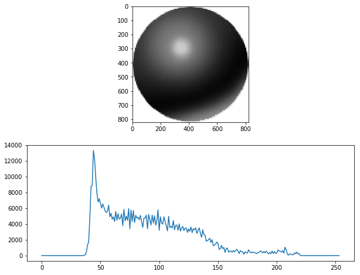

# openCV_Histogram-Contour-Template

##Pipeline (draft)
(still working on it. will be finished soon............................................)  
### Read a Image from Figure or Video Capture  
cv2.imread(filename, flag)  
flag >0 Return a 3-channel color image.  
flag =0 Return a grayscale image  
flag <0 Return the loaded image as is (with alpha channel)  
alternative:  
    cv2.IMREAD_COLOR : Loads a color image. Any transparency of image will be neglected. It is the default flag.  
    cv2.IMREAD_GRAYSCALE : Loads image in grayscale mode  
    cv2.IMREAD_UNCHANGED : Loads image as such including alpha channel  

### Turn into Gray Color Scale  
cv2.cvtColor(image, cv2.COLOR_BGR2GRAY)  

Threshold to remove Background  
Ommit 0 and 255 for Black and White Bacground   

### Plot the Histogram of Image  
cv2.calcHist  
  
  

### Store the major Color from Histogram Analysis:  
  Select the Gray Color Index Range  
  Select the Threshold of Minimum Intensity to render as Background  
  Store the Major Gray Color Index & Intensity for further Propose  
### Bilateral Filter : reduce noise & keep edges sharp 
cv2.bilateralFilter  
  
### Canny Edge Detection 
cv2.Canny(image, min_Val, max_Val)  

### Find Contour: mode & method & hierachy 
  mode  
  method  
  hierachy  
 cv2.findContours  
 cv2.arcLength  # calculates a contour perimeter or a curve length  
 cv2.approxPolyDP  # approximates a polygonal curve(s) with the specified precision  
 area_contour = cv2.contourArea(contour)  # calculate the area of contour  
 0.0025 < area_contour/area_image < 0.80  # compare the area of contour vs whole image, remove < 5%^2 and >80%  
 x,y,w,h = cv2.boundingRect(contour)  # read the contour position(x,y) and dimension( w & h)

Save un-Seen Contour to Template  
### Use Template to Recognize Item in next Image  
####  cv2.matchShapes  
    CONTOURS_MATCH_I1  
    CONTOURS_MATCH_I2  
    CV_CONTOURS_MATCH_I3  
####  cv2.matchTemplate  
    square difference  
    cross correlation  
    correlated coefficient  
### Draw Rectangle and Put Text  
####  cv2.rectangle  
####  cv2.putText 
  
