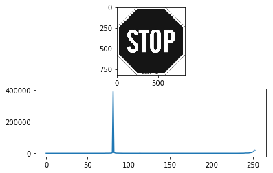
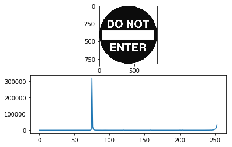

# openCV_Histogram-Contour-Template

##Pipeline (draft)
(still working on it. will be finished soon............................................)  
### Read a Image from Figure or Video Capture  
cv2.imread(filename, flag)  
flag >0 Return a 3-channel color image.  
flag =0 Return a grayscale image  
flag <0 Return the loaded image as is (with alpha channel)  
alternative:  
    cv2.IMREAD_COLOR : Loads a color image. Any transparency of image will be neglected. It is the default flag.  
    cv2.IMREAD_GRAYSCALE : Loads image in grayscale mode  
    cv2.IMREAD_UNCHANGED : Loads image as such including alpha channel  

### Turn into Gray Color Scale  
cv2.cvtColor(image, cv2.COLOR_BGR2GRAY)  

Threshold to remove Background  
Ommit 0 and 255 for Black and White Bacground   

### Plot the Histogram of Image  
cv2.calcHist  
  
 
 
  

### Store the major Color from Histogram Analysis:  
  Select the Gray Color Index Range  
  Select the Threshold of Minimum Intensity to render as Background  
  Store the Major Gray Color Index & Intensity for further Propose  
### Bilateral Filter : reduce noise & keep edges sharp 
cv2.bilateralFilter  
  
### Canny Edge Detection 
cv2.Canny(image, min_Val, max_Val)  

### Find Contour: mode & method & hierachy 
#### cv2.findContours(image, mode, method, contours, hierarchy) 
##### mode  
     CV_RETR_EXTERNAL -- retrieves only the extreme outer contours. It sets hierarchy[i][2]=hierarchy[i][3]=-1 for all the contours.
     CV_RETR_LIST -- retrieves all of the contours without establishing any hierarchical relationships.  
     CV_RETR_CCOMP -- retrieves all of the contours and organizes them into a two-level hierarchy. At the top level, there are external boundaries of the components. At the second level, there are boundaries of the holes. If there is another contour inside a hole of a connected component, it is still put at the top level.  
     CV_RETR_TREE -- retrieves all of the contours and reconstructs a full hierarchy of nested contours. This full hierarchy is built and shown in the OpenCV contours.c demo.  
##### method  
     CV_CHAIN_APPROX_NONE -- stores absolutely all the contour points. That is, any 2 subsequent points (x1,y1) and (x2,y2) of the contour will be either horizontal, vertical or diagonal neighbors, that is, max(abs(x1-x2),abs(y2-y1))==1.  
     CV_CHAIN_APPROX_SIMPLE -- compresses horizontal, vertical, and diagonal segments and leaves only their end points. For example, an up-right rectangular contour is encoded with 4 points.  
     CV_CHAIN_APPROX_TC89_L1,CV_CHAIN_APPROX_TC89_KCOS -- applies one of the flavors of the Teh-Chin chain approximation algorithm. See [TehChin89] for details.  
##### hierachy  
   
 #### cv2.arcLength  # calculates a contour perimeter or a curve length  
 #### cv2.approxPolyDP  # approximates a polygonal curve(s) with the specified precision  
 #### area_contour = cv2.contourArea(contour)  # calculate the area of contour  
 Calculate the AREA of contour, then compare with the AREA of whole image.  
 If AREA of contour is less than (5%)^2, ignore it as background.  
 If AREA of contour is larger than 80% of the whole image, ignore it as backgound.  
 #### 0.0025 < area_contour/area_image < 0.80  # compare the area of contour vs whole image, remove < 5%^2 and >80%  
 Read th econtour position(x,y) and dimension(w & h)  
 x,y,w,h = cv2.boundingRect(contour)  

Save un-Seen Contour to Template  
### Use Template to Recognize Item in next Image  
####  cv2.matchShapes  
    CONTOURS_MATCH_I1  
    CONTOURS_MATCH_I2  
    CV_CONTOURS_MATCH_I3  
####  cv2.matchTemplate  
    square difference  
    cross correlation  
    correlated coefficient  
### Draw Rectangle and Put Text  
####  cv2.rectangle  
####  cv2.putText 
  
